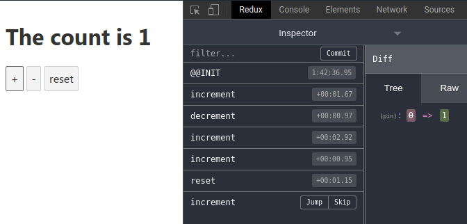
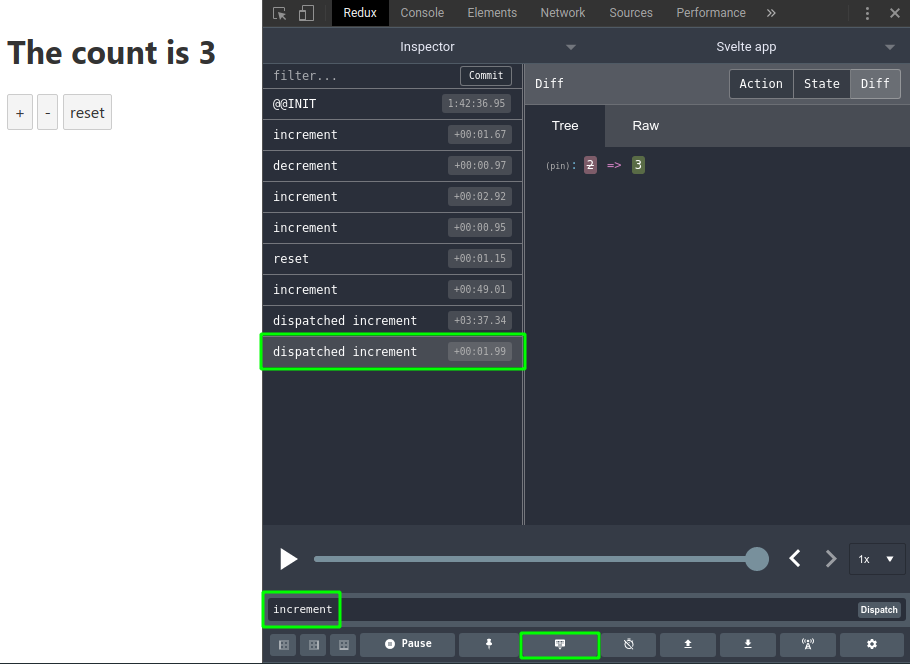
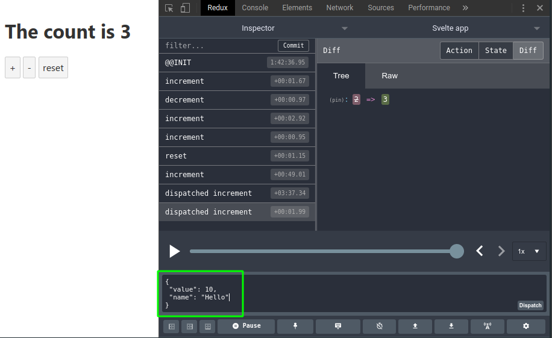

# svelte-reduxify
connect your svelte store to redux devtools

## Installation
```shell script
npm install svelte-reduxify
```

# Usage
```javascript
import { reduxify } from "../svelte-reduxify";

reduxify(store);
```

## Full example
Original code from https://svelte.dev/examples#custom-stores
```javascript
import { writable } from 'svelte/store';

function createCount() {
	const {subscribe, set, update } = writable(0);

	return {
		subscribe,
		increment: () => update(n => n + 1),
		decrement: () => update(n => n - 1),
		reset: () => set(0)
	};
}

export const count = createCount();
```
Modified code
```javascript
import { writable } from 'svelte/store';
import { reduxify } from "svelte-reduxify";

function createCount() {
  const {subscribe, set, update } = writable(0);

  return reduxify({
    subscribe,
    increment: () => update(n => n + 1),
    decrement: () => update(n => n - 1),
    reset: () => set(0)
  });
}

export const count = createCount();
```

## Redux DevTools
### View actions


### Dispatch actions and states
You can dispatch an action by name  
  
You can also dispatch state in `JSON` format  
  